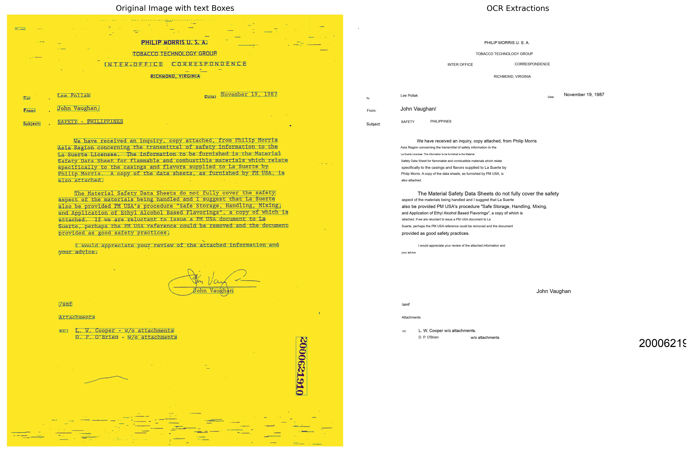

# OCR_ImageRetrieval


<h2>Task 1 : OCR</h2>
<br><br>
     
     <br><br>
<details>
<summary>Deployed Asset Usage: </summary> 
    
   <p>
     <br><br>
     1. To perform OCR and get the response image: 

```bash
     curl --location 'http://43.205.49.236:6000/predict/readDocument' \
           --form 'image=@"/Users/karthik/Downloads/506888300_506888301.jpg"' \
           --form 'ocr_engine="azure"'
 ```

2. To download a JSON with the extractions and NER/POS tags: (change the ocr_engine: 'google', 'azure')
        
```bash
      curl --location 'http://43.205.49.236:6000/predict/getJSON' \
      --form 'image=@"/Users/karthik/Downloads/506888300_506888301.jpg"' \
      --form 'ocr_engine="azure"'
```
      
<br><br>
   </p>
      
</details>

<h2>Task 2 : Document Search & Extraction</h2>

<details>
<summary>Steps to hit the endpoint. </summary> 
    
   <p>
     <br><br>
1. GET /healthcheck
   Check System status.

```bash
  curl --location 'http://43.205.49.236:6050/healthcheck'
```

2. POST /process-directory
   Process a directory containing documents concurrently.: 

```bash
  curl -X 'POST' 'http://43.205.49.236:6050/process-directory' -H 'Content-Type: application/json' \
  -d '{"directory_path": "/path/to/directory","max_workers": 3,"batch_size": 20}'
 ```

3. GET /summary/{filename}
   Retrieve the summary of a processed document by its filename.
        
```bash
   curl -X 'GET' 'http://43.205.49.236:6050/summary/document_name.jpg'
```

4. GET /search/semantic
   Perform a semantic search on the processed documents.
        
```bash
   curl -X 'GET' 'http://43.205.49.236:6050/search/semantic?query=chocolate+factory&k=5'
```


5.  GET /search/keyword
   Search for documents containing a specific keyword.
        
```bash
   curl -X 'GET' 'http://43.205.49.236:6050/search/keyword?keyword=advertisement'
```

      
<br><br>
   </p>
      
</details>
